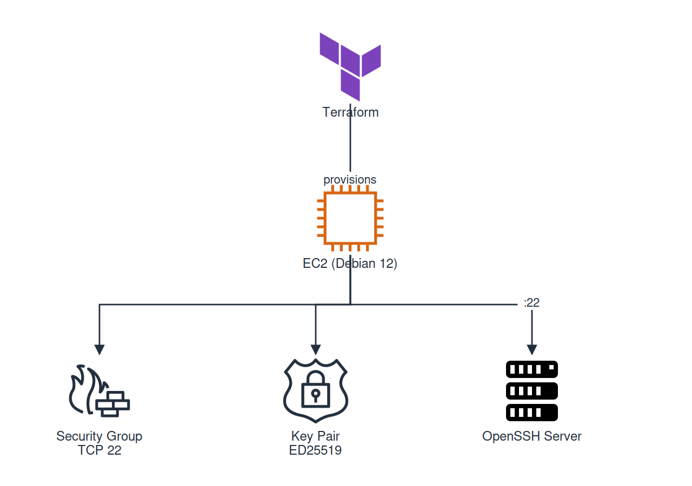

# SSH Remote Server Setup using Terraform and AWS EC2

## Project Overview

This project demonstrates how to provision and securely access a remote Linux server using Infrastructure as Code (IaC) with Terraform on AWS.

The server is deployed as an Amazon EC2 instance running Debian 12. SSH access is configured using public key authentication.

This project is part of the DevOps Roadmap projects and showcases foundational cloud infrastructure, Linux administration, Terraform, and SSH security skills.

---

## Objectives

* Provision infrastructure using Terraform
* Deploy a Debian 12 EC2 instance on AWS
* Create and manage an AWS Key Pair
* Configure Security Groups for SSH access
* Connect securely using SSH keys
* Manage infrastructure using Infrastructure as Code

---

## Technologies Used

* AWS EC2
* Terraform
* Debian 12
* OpenSSH
* AWS Security Groups
* Git & GitHub

---

## Architecture

Terraform provisions the following AWS resources:

* EC2 Instance
* Security Group
* Key Pair

SSH access is configured using an ED25519 key pair.



---

## Project Structure

```text
05-ssh-remote-server-setup/
│
├── terraform/
│   ├── main.tf
│   ├── variables.tf
│   ├── outputs.tf
│   ├── provider.tf
│   └── terraform.tfvars.example
│
├── screenshots/
│
└── README.md
```

---

## Deployment Steps

### Clone Repository

```bash
git clone <repository-url>
cd 05-ssh-remote-server-setup/terraform
```

### Initialize Terraform

```bash
terraform init
```

### Validate Configuration

```bash
terraform validate
```

### Preview Infrastructure Changes

```bash
terraform plan
```

### Deploy Infrastructure

```bash
terraform apply
```

Terraform provisions:

* AWS Key Pair
* Security Group
* Debian 12 EC2 Instance

---

## Terraform Outputs

After deployment:

```bash
terraform output
```

Example:

```text
instance_id = i-xxxxxxxxxxxxxxxxx
public_ip = 54.x.x.x
public_dns = ec2-xx-xx-xx-xx.compute-1.amazonaws.com
ssh_command = ssh admin@54.x.x.x
```

---

## SSH Access

Connect to the server:

```bash
ssh admin@<PUBLIC_IP>
```

Verify:

```bash
whoami
hostnamectl
```

---

## Security Considerations

Implemented:

* Key-based authentication
* Security Group restricted to SSH traffic

Recommended improvement:

Restrict Security Group access to a trusted IP range instead of 0.0.0.0/0.


## Cleanup

Destroy infrastructure when finished:

```bash
terraform destroy
```

This removes all AWS resources created by Terraform and prevents unnecessary charges.

---

## Key Skills Demonstrated

* Infrastructure as Code (Terraform)
* AWS EC2 Management
* Linux Server Administration
* SSH Authentication
* Cloud Infrastructure Provisioning
* Git Version Control

---

## Project URL

https://roadmap.sh/projects/ssh-remote-server-setup
