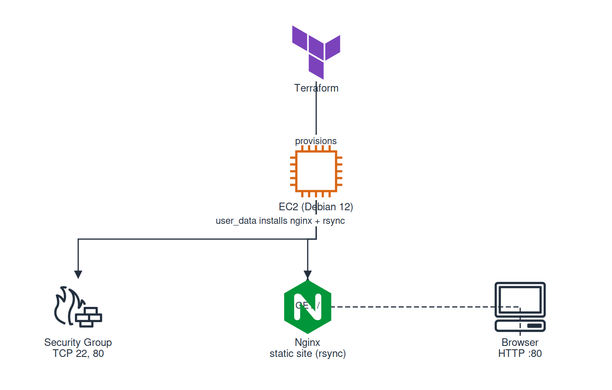

# Static Site with Nginx on AWS EC2

Project 06 of the [DevOps Roadmap](https://roadmap.sh/devops). Provision a remote Linux server with Terraform, serve a static site using Nginx, and deploy changes with rsync.

## Architecture



## Prerequisites

- [AWS CLI](https://aws.amazon.com/cli/) configured (`aws configure`)
- [Terraform](https://www.terraform.io/) >= 1.5.0
- SSH key pair (ED25519 recommended)

## Project Structure

```
06-static-site/
├── terraform/
│   ├── provider.tf              # AWS provider config
│   ├── variables.tf             # Variables (region, public_key, instance_type)
│   ├── main.tf                  # EC2, SG, Key Pair, user_data reference
│   ├── outputs.tf               # public_ip, ssh_command, site_url
│   ├── user_data.sh             # cloud-init script (install nginx + rsync, configure)
│   └── terraform.tfvars.example # Example variable values
├── static-site/
│   ├── index.html               # Main webpage
│   ├── style.css                # Stylesheet
│   └── images/                  # SVG assets
├── deploy.sh                    # rsync deployment script
├── README.md
└── .gitignore
```

## Getting Started

### 1. Clone and configure

```bash
cd 06-static-site/terraform
cp terraform.tfvars.example terraform.tfvars
```

Edit `terraform.tfvars` with your SSH public key:

```hcl
aws_region     = "us-east-1"
public_key     = "ssh-ed25519 AAAAC3NzaC1lZDI1NTE5AAAAI..."
instance_type  = "t3.micro"
key_name       = "devops-static-site-key"
instance_name  = "devops-static-site-server"
```

> **Security:** `terraform.tfvars` is gitignored to prevent leaking my public key.

### 2. Provision infrastructure

```bash
terraform init
terraform plan
terraform apply
```

Terraform provisions:

- **EC2 instance**: Debian 12, t3.micro (free tier eligible)
- **Security Group**: SSH (22) and HTTP (80) from 0.0.0.0/0
- **Key Pair**: SSH access with your public key
- **user_data**: Installs Nginx + rsync, configures virtual host, starts service

### 3. Get server IP

```bash
terraform output public_ip
# Example: 34.238.131.80

terraform output site_url
# Example: http://34.238.131.80

terraform output ssh_command
# Example: ssh admin@34.238.131.80
```

### 4. Deploy the static site

```bash
cd ..
./deploy.sh <SERVER_IP>
```

Example:

```bash
./deploy.sh 34.238.131.80
```

The `deploy.sh` script uses rsync to sync the `static-site/` directory to `/var/www/html/` on the server:

```bash
rsync -avz --delete static-site/ admin@$1:/var/www/html/
```

### 5. Verify

Open `http://<SERVER_IP>` in your browser. You should see the static site with:
- Project description
- Technology cards
- Architecture diagram
- Image gallery with SVG logos

## Deploying Updates

After making changes to `static-site/`, simply run:

```bash
./deploy.sh <SERVER_IP>
```

rsync intelligently syncs only changed files.

## Customization

- **HTML:** Edit `static-site/index.html`
- **CSS:** Edit `static-site/style.css`
- **Images:** Add/remove files in `static-site/images/`
- **Nginx config:** Edit `terraform/user_data.sh` and re-apply Terraform
- **Instance type:** Change `instance_type` in `terraform.tfvars`

## Cleanup

To destroy all AWS resources and avoid ongoing charges:

```bash
cd terraform
terraform destroy
```

## Security Considerations

- Security Group currently allows HTTP (80) and SSH (22) from any IP (`0.0.0.0/0`)
- **Recommended for production:** Restrict SSH to your IP only
- SSH uses key-based authentication (password auth disabled by default on Debian 12)
- Secrets (`terraform.tfvars`) are gitignored

## Skills Demonstrated

| Skill | How |
|-------|-----|
| Infrastructure as Code | Terraform provisions AWS resources |
| Cloud Computing | AWS EC2 (Debian 12) |
| Web Server | Nginx configuration and management |
| Linux Administration | SSH, permissions, systemd |
| Deployment Automation | rsync-based deployment script |
| Static Site | HTML, CSS, image assets |

## Project URL

https://roadmap.sh/projects/static-site-server
