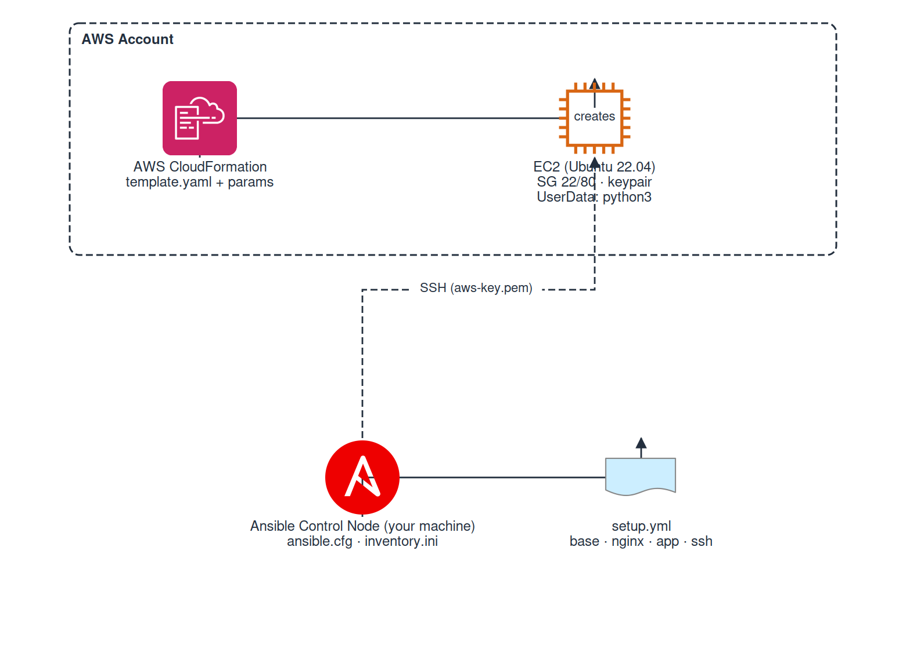

# 13 - Ansible Configuration Management

Provision an EC2 instance with CloudFormation and configure it using Ansible.
Part of the [roadmap.sh DevOps projects](https://roadmap.sh/devops/projects).

---

## Overview

This project does two things in sequence:

1. **CloudFormation** - Creates an EC2 instance (Ubuntu 22.04) on AWS with a security group allowing SSH and HTTP
2. **Ansible** - Connects to that instance and configures it: installs Nginx, deploys a static website, hardens the system with UFW and fail2ban, and adds SSH keys

Everything can be automated with `./deploy.sh` or done manually step by step.

---

## Architecture



---

## How It Works

The project has two independent phases:

### Phase 1: CloudFormation Provisions the Server

`cloudformation/template.yaml` defines:
- A **security group** with inbound rules for SSH (port 22) and HTTP (port 80)
- An **EC2 instance** with Ubuntu 22.04, using a dynamic AMI lookup via AWS SSM Parameter Store
- **UserData** that installs Python3 on boot (required by Ansible)
- The instance is launched with a **key pair**: AWS injects the public key into `ubuntu`'s `authorized_keys`

CloudFormation outputs the instance's **Public IP** when creation finishes.

### Phase 2: Ansible Configures the Server

Ansible connects to the EC2 instance over **SSH** using the private key (`aws-key.pem`). It copies Python modules to the server, executes them, and cleans up. The managed node needs nothing but Python and SSH access.

The playbook (`setup.yml`) applies four roles in order:

| # | Role | What it does |
|---|------|-------------|
| 1 | **base** | Updates packages, installs utilities (`curl`, `wget`, `git`, `htop`, `ufw`, `fail2ban`), enables fail2ban, configures UFW firewall |
| 2 | **nginx** | Installs Nginx, deploys a site config template pointing to `/var/www/html`, starts and enables the service |
| 3 | **app** | Copies `static-site.tar.gz` to the server and extracts it into `/var/www/html` |
| 4 | **ssh** | Creates `.ssh` directory and adds a public key to `ubuntu`'s `authorized_keys` |

---

## SSH Key Pair Management

### What keys do you need and where?

```
AWS EC2 Console              Your Machine (Control Node)        EC2 Instance (Managed Node)
─────────────────            ─────────────────────────────      ─────────────────────────────
Key Pair: aws-key            aws-key.pem  (private, chmod 600)  ~/.ssh/authorized_keys
  └─ stores public key       aws-key.pub  (public, derived)     ├─ aws-key's public key (from AWS)
                                                               └─ aws-key.pub (from ssh role)
```

### On AWS (EC2 Key Pairs)
- Create a **key pair** in EC2 named `aws-key`. AWS generates a public/private key pair.
- The **public key** is stored by AWS. When you launch an instance referencing this key pair name, AWS injects the public key into `/home/ubuntu/.ssh/authorized_keys`.
- You **download** the private key as `aws-key.pem`.

### On the Ansible Control Node (Your Machine)
You need two files:

1. **`~/.ssh/aws-key.pem`** - The private key. This authenticates you to the server.
   - **Must have permissions `600`** (`chmod 600 aws-key.pem`). SSH refuses keys with open permissions.
   - Referenced in `ansible.cfg` as `private_key_file`.

2. **`~/.ssh/aws-key.pub`** - The public key (optional but useful).
   - Not needed for SSH itself, but needed by the `ssh` role which uses the `authorized_key` module.
   - Generate it from the private key:
     ```bash
     ssh-keygen -y -f ~/.ssh/aws-key.pem > ~/.ssh/aws-key.pub
     ```

### On the Managed Node (EC2 Instance)
- Starts with `aws-key`'s public key in `authorized_keys` (injected by AWS at launch)
- After the `ssh` role runs, the public key from your control node is also added, this is useful if you want additional keys or to ensure access via a different key

### Why two places reference the key?
- **`ansible.cfg`**: tells Ansible which **private key** to use when connecting over SSH
- **`roles/ssh/tasks/main.yml`**: tells Ansible to add your **public key** to the server's authorized_keys (so you can SSH in with your private key even if the AWS key pair mechanism didn't work)

---

## Every File Explained

### `cloudformation/template.yaml`: CloudFormation Infrastructure Template

```
AWSTemplateFormatVersion: "2010-09-09"
Description: "EC2 instance for Ansible Configuration Management project"
```

**Parameters (inputs you provide when creating the stack):**

| Parameter | Type | Description | Default |
|-----------|------|-------------|---------|
| `InstanceType` | String | EC2 instance type (restricted to whitelist) | `t2.micro` |
| `LatestAmiId` | SSM Parameter | Latest Ubuntu 22.04 AMI via SSM | /aws/service/canonical/.../ami-id |
| `KeyName` | EC2 KeyPair | Name of existing EC2 key pair | — |
| `SSHLocation` | String | CIDR block allowed SSH access | `0.0.0.0/0` |

The **`LatestAmiId`** uses `AWS::SSM::Parameter::Value<AWS::EC2::Image::Id>` to fetch the latest AMI dynamically. NOhardcoded AMI IDs that break across regions.

**Resources (what gets created):**

| Resource | Type | Purpose |
|----------|------|---------|
| `ServerSecurityGroup` | `AWS::EC2::SecurityGroup` | Opens port 22 (SSH) and port 80 (HTTP) |
| `EC2Instance` | `AWS::EC2::Instance` | Ubuntu 22.04 server with UserData that installs Python3 |

**Outputs (returned after stack creation):**

| Output | Value |
|--------|-------|
| `PublicIP` | `!GetAtt EC2Instance.PublicIp` |
| `PublicDns` | `!GetAtt EC2Instance.PublicDnsName` |
| `InstanceId` | `!Ref EC2Instance` |

### `cloudformation/parameters.json`: Stack Parameter Values

Supplies concrete values matching the template parameters:

```json
[
  {"ParameterKey": "InstanceType", "ParameterValue": "t3.micro"},
  {"ParameterKey": "KeyName",       "ParameterValue": "aws-key"},
  {"ParameterKey": "SSHLocation",   "ParameterValue": "0.0.0.0/0"}
]
```

### `ansible.cfg`: Ansible Control Node Configuration

```ini
[defaults]
host_key_checking = False
inventory = inventory.ini
private_key_file = /home/wazaglo/aws-key.pem
remote_user = ubuntu
```

| Setting | Purpose |
|---------|---------|
| `host_key_checking = False` | Skips SSH host key verification (OK for ephemeral instances) |
| `inventory = inventory.ini` | Points to the file listing target servers |
| `private_key_file = ...` | The SSH private key Ansible uses to authenticate |
| `remote_user = ubuntu` | Default SSH user on managed nodes (can be overridden per-host in inventory) |

### `inventory.ini`: Managed Node Inventory

```ini
[webserver]
3.93.197.127 ansible_user=ubuntu
```

- `[webserver]` is a **group name**. The playbook uses `hosts: webserver` to target this group.
- `ansible_user=ubuntu` overrides the SSH user for this specific host (takes precedence over `remote_user` in `ansible.cfg`).

### `setup.yml`: Ansible Playbook (Entry Point)

```yaml
- hosts: webserver          # Target the 'webserver' group in inventory
  become: yes               # Escalate privileges (sudo) for all tasks
  roles:
    - role: base            # tagged 'base'
    - role: nginx           # tagged 'nginx'
    - role: app             # tagged 'app'
    - role: ssh             # tagged 'ssh'
```

- **`become: yes`**: All tasks run with root privileges. Without this, `apt`, `service`, `ufw`, etc. would fail.
- **Tags**: Allow running specific roles with `ansible-playbook setup.yml --tags "nginx"` or skipping with `--skip-tags "base"`.

### `roles/base/tasks/main.yml`: System Hardening

```yaml
- name: Update apt cache and upgrade all packages
  apt: update_cache: yes, upgrade: dist

- name: Install required system utilities
  apt: curl, wget, htop, git, ufw, fail2ban

- name: Enable and start fail2ban
  service: fail2ban, started, enabled

- name: Allow SSH through ufw
  ufw: allow port 22/tcp

- name: Allow HTTP through ufw
  ufw: allow port 80/tcp

- name: Enable ufw
  ufw: enabled, default deny
```

Ansible **modules** used: `apt`, `service`, `ufw`.

### `roles/nginx/`: Web Server

**`tasks/main.yml`:**
```yaml
- name: Install nginx
  apt: nginx

- name: Deploy nginx site configuration
  template: site.conf.j2 → /etc/nginx/sites-available/default
  notify: restart nginx          # ← triggers the handler

- name: Ensure nginx is running and enabled
  service: nginx, started, enabled
```

- The `template` module takes `site.conf.j2` from `roles/nginx/templates/` and renders it (Jinja2) to the target path. Even though this template has no variables, it's still a template for future flexibility.
- `notify: restart nginx` triggers the handler below.

**`handlers/main.yml`:**
```yaml
- name: restart nginx
  service: nginx, restarted
```

A **handler** is like a task but:
- Only runs when notified (by `notify` in a task)
- Runs only once at the end of the play, even if multiple tasks notify it
- Common use case: restart a service after config changes

**`templates/site.conf.j2`:**
```nginx
server {
    listen 80 default_server;
    root /var/www/html;
    index index.html index.htm;
    server_name _;
    location / { try_files $uri $uri/ =404; }
}
```

A basic Nginx server block. The `$uri` and `$uri/` are Nginx variables (not Jinja2, they pass through since the template uses raw Nginx syntax).

### `roles/app/tasks/main.yml`: Deploy the Static Site

```yaml
- name: Copy static site tarball to server
  copy: static-site.tar.gz → /tmp/static-site.tar.gz

- name: Extract tarball to web root
  unarchive: /tmp/static-site.tar.gz → /var/www/html/, remote_src: yes
```

- The `copy` module copies a file from `roles/app/files/` on the control node to the managed node.
- The `unarchive` module with `remote_src: yes` means the source file is already on the remote server (copied in the previous step).
- `static-site.tar.gz` contains `index.html` and any other site assets. After extraction, Nginx serves them from `/var/www/html/`.

### `roles/ssh/tasks/main.yml`: Add SSH Access

```yaml
- name: Ensure .ssh directory exists
  file: path=/home/ubuntu/.ssh, directory, owner=ubuntu, mode=0700

- name: Add public key to authorized_keys
  authorized_key:
    user: ubuntu
    key: "{{ lookup('file', '~/.ssh/aws-key.pub') }}"
```

- The `file` module ensures the `.ssh` directory exists with correct permissions.
- The `authorized_key` module adds a public key to the user's `authorized_keys`.
- **`lookup('file', '~/.ssh/aws-key.pub')`**: This is a **lookup plugin**. It reads a file from the **control node's local filesystem** (not the managed node). The tilde `~` expands to the home directory of the user running Ansible.

### `deploy.sh`: Automation Script

```bash
set -euo pipefail
STACK_NAME="ansible-server"

aws cloudformation create-stack ... --parameters file://cloudformation/parameters.json
aws cloudformation wait stack-create-complete --stack-name "$STACK_NAME"
PUBLIC_IP=$(aws cloudformation describe-stacks ...)
cat > inventory.ini <<EOF
[webserver]
$PUBLIC_IP ansible_user=ubuntu
EOF
ansible-playbook setup.yml
```

Each line automates one manual step (see below).

---

## Ansible Concepts

| Concept | Explanation |
|---------|-------------|
| **Control Node** | Your machine — runs `ansible-playbook`, holds playbooks, roles, inventory, and private keys |
| **Managed Node** | The target server (EC2). It only needs Python and SSH access. Ansible is **agentless** — no software is installed on managed nodes |
| **Inventory** | A file listing managed nodes (IPs/hostnames) organized into groups like `[webserver]` |
| **Playbook** | A YAML file defining which hosts to target and what to do (`setup.yml`) |
| **Task** | A single action using an Ansible module (e.g., "Install nginx", "Copy a file") |
| **Module** | A built-in tool: `apt`, `copy`, `template`, `service`, `ufw`, `authorized_key`, `file`, `unarchive`. Modules are **idempotent** — running them multiple times produces the same result |
| **Role** | A reusable bundle of tasks, handlers, templates, and files organized under `roles/role_name/` |
| **Handler** | A task triggered by `notify`. Runs once at the end of the play. Used for things like "restart nginx after config change" |
| **Template** | A Jinja2 file (`.j2`) that can contain variables. Rendered to the target server |
| **Lookup Plugin** | Reads data from the control node's filesystem (`lookup('file', 'path')`) |
| **`become: yes`** | Escalates privileges (sudo). Required for admin tasks like installing packages or managing services |
| **Idempotency** | Running the same playbook multiple times produces the same result — tasks are skipped if the desired state is already met |

---

## Prerequisites

- AWS CLI installed and configured (`aws configure`)
- Ansible installed (`pip install ansible` or `sudo apt install ansible`)
- An EC2 key pair named `aws-key` created in your AWS account (EC2 Console → Key Pairs)
- Private key downloaded to `~/.ssh/aws-key.pem` with permissions `600`:
  ```bash
  chmod 600 ~/.ssh/aws-key.pem
  ```
- Public key derived from the private key:
  ```bash
  ssh-keygen -y -f ~/.ssh/aws-key.pem > ~/.ssh/aws-key.pub
  ```
- Python3 present on the control node
- IAM permissions: EC2 (CreateInstances, DescribeInstances, CreateSecurityGroup), CloudFormation (CreateStack, DescribeStacks, DeleteStack)

---

## Deployment

### Option 1: Automated (`./deploy.sh`)

```bash
chmod +x deploy.sh
./deploy.sh
```

This single command:
1. Creates the CloudFormation stack (`ansible-server`)
2. Waits for it to finish
3. Retrieves the Public IP
4. Writes it into `inventory.ini`
5. Runs `ansible-playbook setup.yml`

### Option 2: Manual Step-by-Step

Each of these steps is what `deploy.sh` does internally.

#### Step 1: Create the CloudFormation Stack

```bash
aws cloudformation create-stack \
  --stack-name ansible-server \
  --template-body file://cloudformation/template.yaml \
  --parameters file://cloudformation/parameters.json \
  --capabilities CAPABILITY_NAMED_IAM
```

#### Step 2: Wait for Stack Creation

```bash
aws cloudformation wait stack-create-complete \
  --stack-name ansible-server
```

#### Step 3: Get the Public IP

```bash
PUBLIC_IP=$(aws cloudformation describe-stacks \
  --stack-name ansible-server \
  --query "Stacks[0].Outputs[?OutputKey=='PublicIP'].OutputValue" \
  --output text)
echo "Public IP: $PUBLIC_IP"
```

#### Step 4: Update the Inventory File

```bash
cat > inventory.ini <<EOF
[webserver]
$PUBLIC_IP ansible_user=ubuntu
EOF
```

#### Step 5: Run the Ansible Playbook

```bash
ansible-playbook setup.yml
```

#### Step 6: Verify the Site

```bash
curl http://$PUBLIC_IP
```

You should see the HTML of the static site.

#### Step 7: Cleanup (when done)

```bash
aws cloudformation delete-stack --stack-name ansible-server
```

---

## Running Selective Roles

```bash
# Run only nginx role
ansible-playbook setup.yml --tags "nginx"

# Run only app role
ansible-playbook setup.yml --tags "app"

# Skip base role
ansible-playbook setup.yml --skip-tags "base"
```

---

## Troubleshooting

| Error | Cause | Fix |
|-------|-------|-----|
| Stack rolls back: `"instance type is not eligible for Free Tier"` | Selected instance type not available in this account/region | Change `InstanceType` to `t3.micro` in `cloudformation/parameters.json` |
| `UNPROTECTED PRIVATE KEY FILE` — permissions 0755 | Private key file has open permissions | `chmod 600 ~/.ssh/aws-key.pem` |
| YAML error: `mapping values are not allowed` | Incorrect indentation in a YAML file | Ensure consistent 2-space indentation. `key:` must be at same level as `user:` |
| `The 'file' lookup had an issue accessing the file '~/.ssh/aws-key.pub'` | Public key file doesn't exist on the control node | Generate it: `ssh-keygen -y -f ~/.ssh/aws-key.pem > ~/.ssh/aws-key.pub` |
| `Permission denied (publickey)` | Key name mismatch — CloudFormation launches with key A but Ansible tries key B | Ensure `KeyName` in `parameters.json` matches the private key in `ansible.cfg` |
| `Failed to connect via SSH` — timeout | Security group not allowing SSH, or wrong IP | Verify the security group has an inbound rule for port 22 |

---

## Project Structure

```
13-ansible-configuration/
├── README.md                          # This file
├── setup.yml                          # Ansible playbook (entry point)
├── inventory.ini                      # Target server IP and SSH user
├── ansible.cfg                        # Ansible control node configuration
├── deploy.sh                          # One-click deploy script
├── cloudformation/
│   ├── template.yaml                  # CloudFormation stack definition
│   └── parameters.json                # Stack parameter values
└── roles/
    ├── base/
    │   └── tasks/main.yml             # apt update, fail2ban, ufw, utilities
    ├── nginx/
    │   ├── tasks/main.yml             # Install & configure nginx
    │   ├── templates/site.conf.j2     # Nginx site config template
    │   └── handlers/main.yml          # restart nginx handler
    ├── app/
    │   ├── tasks/main.yml             # Deploy static site to web root
    │   └── files/static-site.tar.gz   # Static website archive (copied to server)
    └── ssh/
        └── tasks/main.yml             # Add SSH public key to authorized_keys
```

---

## Verification

```bash
curl http://<PUBLIC_IP>
# Should return the static site HTML
```

You can also SSH into the instance to verify configuration:

```bash
ssh -i ~/.ssh/aws-key.pem ubuntu@<PUBLIC_IP>
# Check services:
sudo systemctl status nginx
sudo ufw status
sudo fail2ban-client status
```

---

## Cleanup

```bash
aws cloudformation delete-stack --stack-name ansible-server
```

This terminates the EC2 instance, deletes the security group, and removes the CloudFormation stack.
