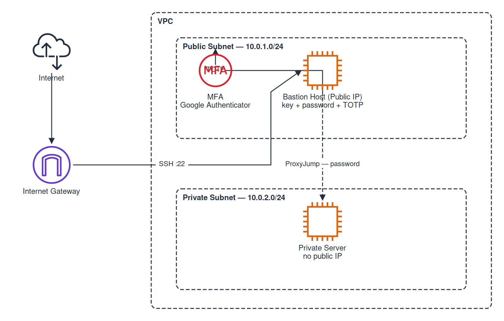

# Bastion Host Setup with MFA

AWS bastion host as secure entry point to a private server. MFA (Google Authenticator) configured manually post-deploy.

## Architecture



**Bastion MFA Flow**: SSH Key → Password → TOTP (all required, fail at any = denied)

## Prerequisites

- AWS CLI configured, Terraform >= 1.5.0
- SSH key pair `bastion-host-key` created in AWS EC2 → Key Pairs
- Your public IP: `curl -s https://checkip.amazonaws.com`

## Deploy

```bash
cd 19-bastion-host/terraform
cp terraform.tfvars.example terraform.tfvars
# Edit: allowed_ssh_cidr = "YOUR_IP/32", admin_password = your password
terraform init && terraform apply
```

Outputs include bastion IP, private IP, and `~/.ssh/config` snippet.

## Connect

```bash
ssh -i ~/.ssh/bastion-host-key.pem admin@<BASTION_IP>       # bastion
ssh -J admin@<BASTION_IP> admin@<PRIVATE_IP>                 # private via bastion
```

## Manual MFA Setup (on Bastion)

```bash
ssh bastion
google-authenticator -t -d -f -r 3 -R 30 -W     # answer Yes to all prompts
```

Edit `/etc/pam.d/sshd` — add before `@include` lines:
```
auth requisite pam_google_authenticator.so nullok
```

Edit `/etc/ssh/sshd_config`:
```
AuthenticationMethods publickey,password keyboard-interactive:pam
ChallengeResponseAuthentication yes
UsePAM yes
```

```bash
sudo systemctl restart ssh   # test in new terminal before closing current
```

Scan QR code with Google Authenticator app. Next SSH will prompt: key → password → TOTP.

## fail2ban

Pre-configured on bastion: 3 retries → 1hr ban. Check: `sudo fail2ban-client status sshd`

## Cleanup

```bash
terraform destroy
```

https://roadmap.sh/projects/bastion-host